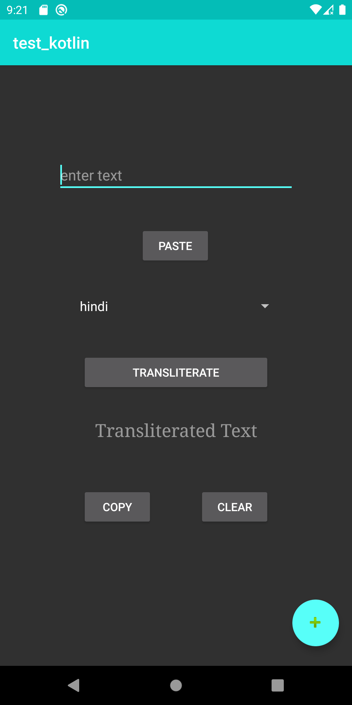
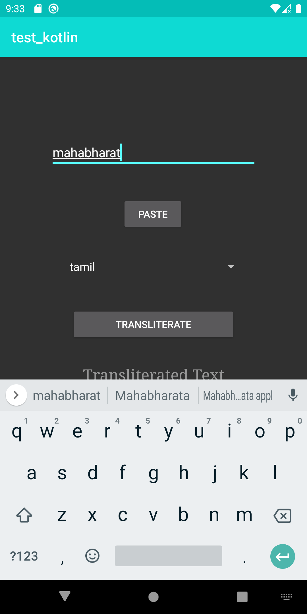
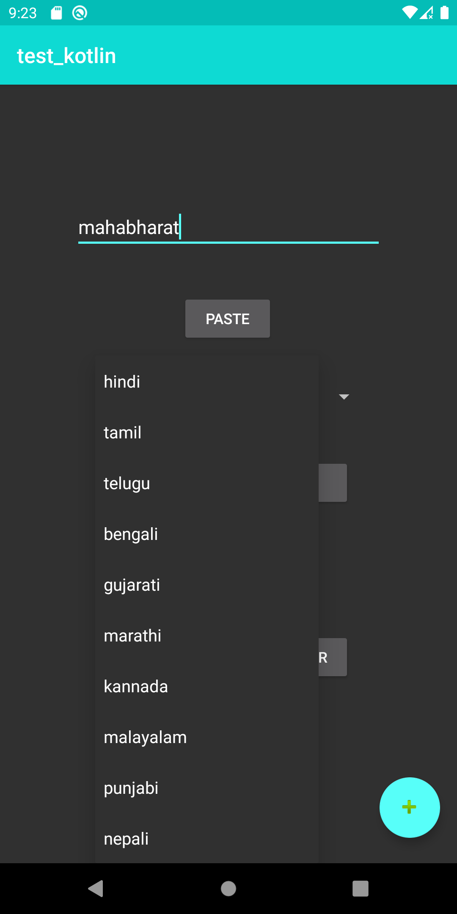
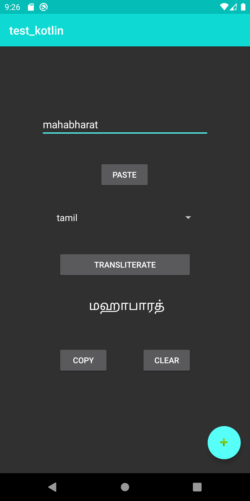
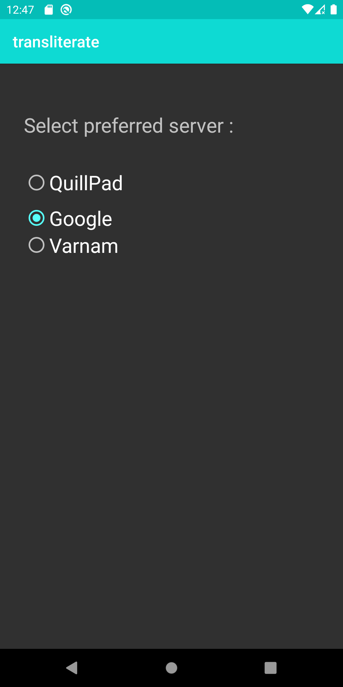

# Transliterate
In [this](https://github.com/srinis98/transliterate/tree/master/generated-apk) app, the input text is transliterate into the language selected. 
Three options are provided for server selection.

## Instructions for Download: 
1) Download the app [here](https://github.com/srinis98/transliterate/tree/master/generated-apk).
2) Install and run the application.

## Screenshots
<table>
<tr>
<td>

</td>
<td>

</td>
<td>

</td>
<td>

</td>
<td>

</td>
</tr>
</table>

## References
1)https://www.youtube.com/playlist?list=PLt72zDbwBnAX9UeFwoh-lSZb5c_XrOOf7
2) https://stackoverflow.com/questions/44096838/kotlin-how-to-get-and-set-a-text-to-textview-in-android-using-kotlin 
3) https://developer.android.com/guide/topics/ui/controls/spinner#kotlin 
4) https://www.geeksforgeeks.org/spinner-in-kotlin/
5) https://android--code.blogspot.com/2019/02/android-kotlin-volley-post-request-with.html 
6) https://thesimplycoder.com/282/android-copy-to-clipboard-using-kotlin/ 
7) https://stackoverflow.com/questions/2390102/how-to-set-selected-item-of-spinner-by-value-not-by-position/14640612
8) https://www.tutorialspoint.com/android/android_radiogroup_control.html
9) https://thesimplycoder.com/282/android-copy-to-clipboard-using-kotlin/#:~:text=Pasting%20Text%20from%20Clipboard&text=You%20can%20paste%20the%20text,to%20our%20TextView%20from%20activity_main
